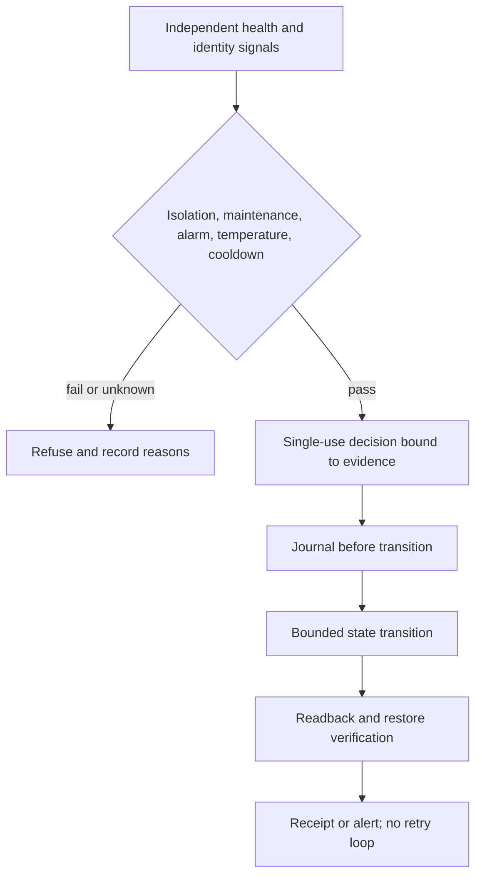

```mermaid
flowchart TD
    S["Independent health and identity signals"] --> G{"Isolation, maintenance, alarm, temperature, cooldown"}
    G -->|fail or unknown| N["Refuse and record reasons"]
    G -->|pass| D["Single-use decision bound to evidence"]
    D --> J["Journal before transition"]
    J --> O["Bounded state transition"]
    O --> V["Readback and restore verification"]
    V --> R["Receipt or alert; no retry loop"]
```
