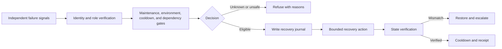

```mermaid
flowchart LR
  S["Independent failure signals"] --> I["Identity and role verification"]
  I --> G["Maintenance, environment, cooldown, and dependency gates"]
  G --> D{"Decision"}
  D -->|Unknown or unsafe| R["Refuse with reasons"]
  D -->|Eligible| J["Write recovery journal"]
  J --> A["Bounded recovery action"]
  A --> V["State verification"]
  V -->|Mismatch| B["Restore and escalate"]
  V -->|Verified| C["Cooldown and receipt"]
```
